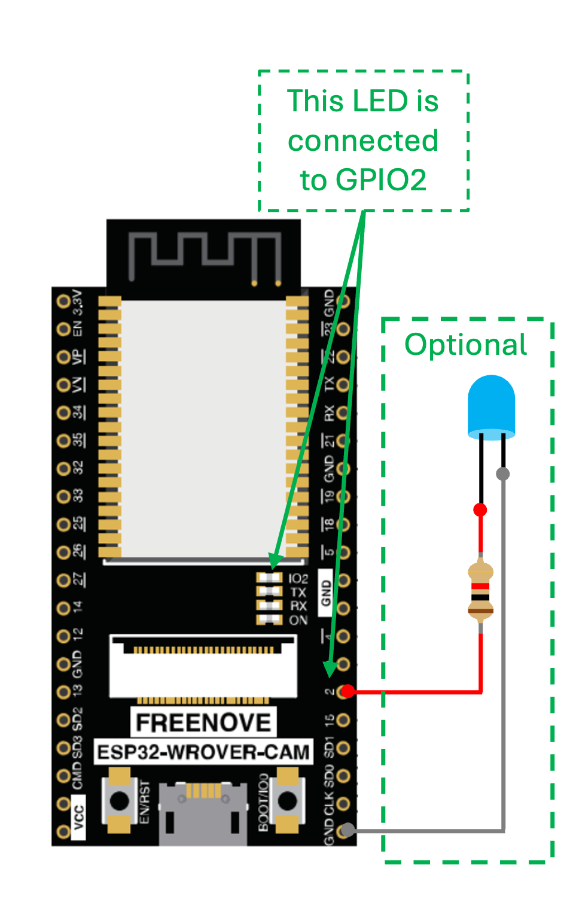

# Lesson 1: Blinking an LED with ESP32 (ESP-IDF)

Welcome to the first lesson in our ESP-IDF embedded systems series.  
Here, we learn the most fundamental operation in microcontroller programming: **blinking an LED**.

---

## 🧠 Objective

- Understand how to control a digital output pin using ESP-IDF
- Use `gpio_set_level()` and `vTaskDelay()` to blink the on-board LED

---

## 🔌 Circuit




---

## 📄 Code (`main.c`)

```c
#include "freertos/FreeRTOS.h"
#include "freertos/task.h"
#include "driver/gpio.h"

#define LED_PIN GPIO_NUM_2

void app_main(void)
{
    gpio_reset_pin(LED_PIN);                      // Reset the GPIO pin to its default state
    gpio_set_direction(LED_PIN, GPIO_MODE_OUTPUT); // Configure the pin as an output

    while (1) {
        gpio_set_level(LED_PIN, 1);                // Turn LED ON
        vTaskDelay(pdMS_TO_TICKS(500));            // Delay 500 ms
        gpio_set_level(LED_PIN, 0);                // Turn LED OFF
        vTaskDelay(pdMS_TO_TICKS(500));            // Delay 500 ms
    }
}
```
## 🔍 Code Explanation

- `#include "freertos/FreeRTOS.h"`, `#include "freertos/task.h"`, and `#include "driver/gpio.h"`  
  These include the required ESP-IDF libraries for task delays and GPIO control.

- `#define LED_PIN GPIO_NUM_2`  
  This defines `LED_PIN` as GPIO 2, which is usually connected to the onboard LED on most ESP32 boards.

- `gpio_reset_pin(LED_PIN);`  
  Resets the GPIO pin to its default state. This is required in ESP-IDF v5.0+ before configuring it.

- `gpio_set_direction(LED_PIN, GPIO_MODE_OUTPUT);`  
  Sets the pin mode to output, so the ESP32 can control the LED.

- `gpio_set_level(LED_PIN, 1);`  
  Sends a HIGH signal (3.3V) to the LED pin — turns the LED **ON**.

- `vTaskDelay(pdMS_TO_TICKS(500));`  
  Pauses execution for 500 milliseconds. The `pdMS_TO_TICKS()` macro converts milliseconds to FreeRTOS ticks.

- `gpio_set_level(LED_PIN, 0);`  
  Sends a LOW signal (0V) to the LED pin — turns the LED **OFF**.

- `while (1) { ... }`  
  Creates an infinite loop that continuously blinks the LED.