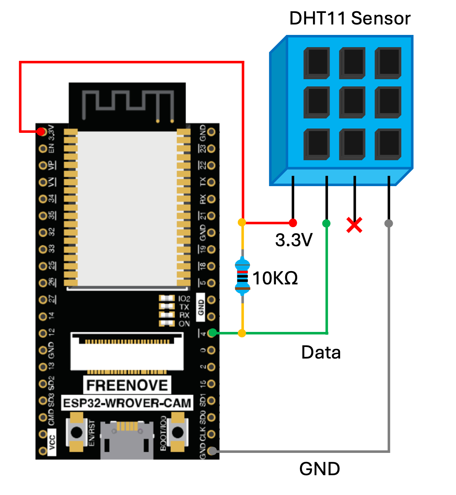

# 🌡️ Lesson 10: Reading a Temperature Sensor (DHT11)

This lesson demonstrates how to read temperature and humidity data from a **DHT11 sensor** using the ESP32 and the ESP-IDF framework. The values are printed to the serial monitor every 2 seconds.

---

## 🎯 Objectives

- Interface a DHT11 sensor with the ESP32.
- Use a third-party ESP-IDF component (`esp32-dht`) for communication.
- Read and display temperature and humidity values.
- Understand sensor reading intervals and error handling.

---
## 📦 Library Installation Steps

To install and use the `esp32-dht` component in your ESP-IDF project:

1. Export the ESP-IDF environment: `source ~/esp/v5.4.1/esp-idf/export.sh`
2. Add the DHT sensor library using the component manager:`idf.py add-dependency "achimpieters/esp32-dht^1.0.0"`

---

## 🔌 Circuit




| DHT11 Pin | ESP32 Pin     | Notes                          |
|-----------|---------------|--------------------------------|
| VCC       | 3.3V          | Power                          |
| DATA      | GPIO4         | Connect with 10kΩ pull-up to 3.3V |
| NC        | NC            | Not Connected                  |
| GND       | GND           | Ground                         |


📌 Make sure to use a 10kΩ resistor between **DATA** and **VCC** for reliable operation.

---

## 💻 Code

```c
#include <stdio.h>
#include "freertos/FreeRTOS.h"
#include "freertos/task.h"
#include "dht.h"

#define DHT_GPIO GPIO_NUM_4
#define DHT_TYPE DHT_TYPE_DHT11

void app_main(void)
{
    float temperature = 0.0f, humidity = 0.0f;

    while (1) {
        esp_err_t result = dht_read_float_data(DHT_TYPE, DHT_GPIO, &humidity, &temperature);
        if (result == ESP_OK) {
            printf("Humidity: %.1f %%\n", humidity);
            printf("Temperature: %.1f °C\n", temperature);
        } else {
            printf("Failed to read from DHT sensor: %s\n", esp_err_to_name(result));
        }

        vTaskDelay(pdMS_TO_TICKS(2000));
    }
}
```

---
## 🧠 Code Concepts

- **Third-party Component Usage**  
  The `esp32-dht` library was installed using `idf.py add-dependency`, enabling easier integration and reuse of reliable DHT sensor code.

- **Sensor Communication**  
  The DHT11 sensor uses a single-wire protocol that requires precise timing, which is fully handled by the `esp32-dht` library.

- **Error Handling**  
  The return value of `dht_read_float_data()` is checked, and any error is printed using `esp_err_to_name()` to help with debugging.

- **FreeRTOS Delay**  
  The temperature and humidity reading interval is managed using `vTaskDelay()` in combination with `pdMS_TO_TICKS()` for readable and accurate timing.